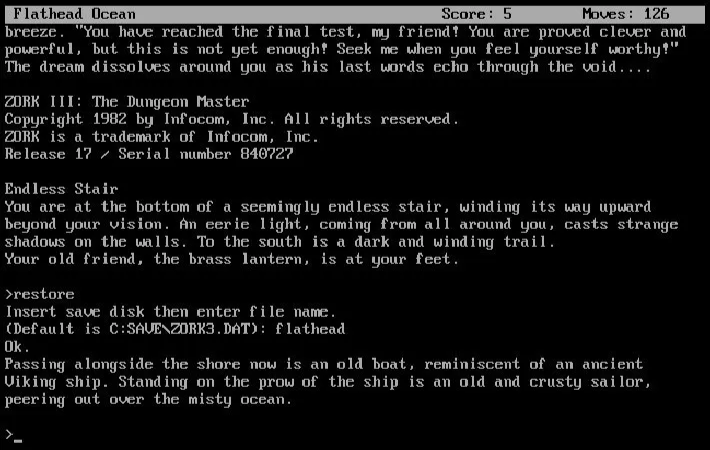
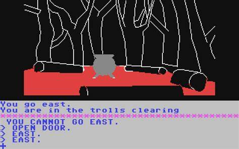
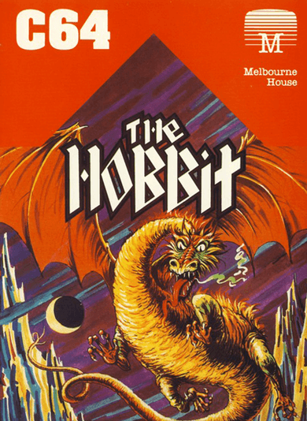
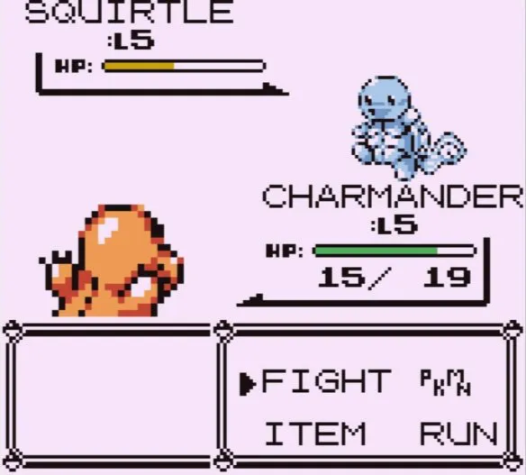
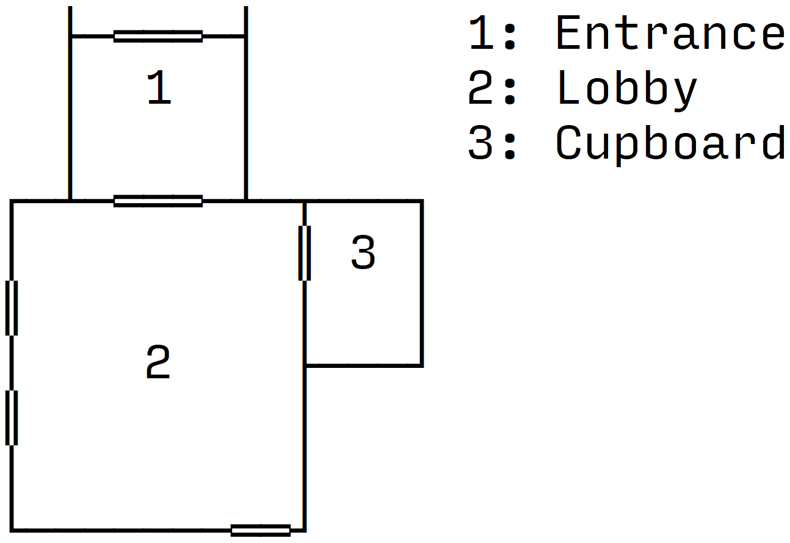

# Analysis

## Overview
Space is a classic-style text adventure game, written in Java. It consists of entering commands to perform actions within the game, while the world is continuously described by the program, who is the narrator. There will be loot and weapons to find, enemies to defeat, and puzzles to solve. There will be enemies of varying difficulty to battle against, and a final boss guarding the finish for the game.

## Features Solvable by Computational Methods

### Querying & Inserting Data
The program will have to query data from the database when logging into an account to check for matching data, and when displaying the leaderboard.
It will have to insert data into the database when creating a new account, and when saving players’ highest scores.

### Iteration
After the game begins, the entirety of the code will be running through iteration, as it will be a constant loop of describing the world, and the player entering commands.
When executing certain commands (such as use, take, and examine), the program will use iteration to determine what items and/or entities the player is referencing by looping through everything in their inventory and in the room they’re currently in.

### Sorting
When viewing the leaderboard, the game will use an insertion sort algorithm to retrieve a certain number of high scores and display them to the player in order of highest to lowest.
The player’s inventory will also utilise an insertion sort algorithm to put all items in order alphabetically.

## Stakeholders

### Developer/Me (internal)
I will be developing the game, and also playing it for testing.

### Younger Players (internal)
Younger players are players aged under thirty-five. They will likely be playing as a large proportion of people in that age group play video games often.

| Requirement | Why | How |
| --- | --- | --- |
| Intuitive controls | As younger players are unlikely to have come across text-based adventure games before, it’s important to make the controls (commands and parameters) easy to understand, to prevent players from becoming frustrated and not wanting to play. | For each command, there will be a list of acceptable aliases (for example, to pickup an item, a player could either type “pickup”, or “take”, etc.). The game will also try to explain to the player what they typed wrong if there was a syntax error in their command. |
| Challenging sections | To prevent the player from becoming bored, it’s important to have challenging sections. This is especially important for younger players as they will likely be used to modern games that often have very complex problems. | The game will contain challenging puzzles and enemies that are difficult to defeat. |
| Fun combat system | As younger players will likely be used to modern games such as first-person shooters, the game will need a combat system that is fun and will keep the player engaged. | The combat system needs to be a balance between challenging, easy to understand, and luck-based. To accomplish this, it will undergo lots of testing with different people, and their views will be recorded, and the game adjusted to help. I will also take inspiration from games using similar systems, such as Pokémon. |

### Older Players (internal)
Older players are players aged thirty-five and over - this is due to the timeframe when text-based adventures were most popular, as they started to become less-so towards the 90s, so they are the ones likely to have played them as children. They will likely be playing due to nostalgia.

| Requirement | Why | How |
| --- | --- | --- |
| Classic look and feel | As older people will most likely be playing due to nostalgia, it’s important that the game will look and feel similar to those they would’ve played as children. | I will take inspiration from original, text-based adventure games such as Zork and The Hobbit, incorporating key elements such as old-fashioned fonts and looking like a console. |
| Engaging storyline | As older players are typically more invested in the story of a game compared to younger players, it’s important to maintain its quality throughout the game to keep them engaged. | I will plan the entirety of the story out before hand and run it past a small selection of people that would be likely to play the game. I will then make adjustments according to their feedback. |

### PEGI (external)
PEGI (Pan-European Game Information) is an organisation that rates games for age suitability based on their content. They will be playing to judge what ages the game is suitable for.

| Requirement | Why | How |
| --- | --- | --- |
| Follow the PEGI Code | All games distributed within the EU must comply with the PEGI Code in order to receive a PEGI age rating. As these are ratings can be highly influential on whether people can play the game or not, it’s important the game complies. | The game will be in compliance with the application data protection and privacy laws. It will also not contain any monetisation methods. |

## Similar Games

### Zork

Zork is a text-based adventure game, released in 1977. It was extremely popular, and likely the most famous one to this date. In the game, the player explores the ruined Great Underground Empire, and must complete puzzles and move around the map to proceed. To interact with the world, the player enters commands into a command line interface, the computer then responds to them, acting as the story’s narrator. The commands it accepts are very complex , allowing things like “north” and “get lamp”, but also “put the lamp and the sword in the case”.
It followed a linear storyline, meaning that all players would have to complete the same challenges in the same way, in the same order. The entirety of the first title took, on average, two and a half hours to complete.

| Feature | Description | Conclusion |
| --- | --- | --- |
| Complex command system | The command system in Zork is very complex, allowing players to type commands in virtually plain English. This was very effective as it meant players didn’t have to read any instructions before playing. This makes the game extremely user-friendly and would’ve definitely helped in popularity when it was released. | I will not be incorporating this feature into my game, as I do not have the time available that it would take to implement. This will result in my game being less user-friendly, as players will likely have to review a list of commands at the start so they know what is allowed. To mitigate the effect of this, I will be adding aliases for the commands - common alternatives for keywords. For example, you could either type “take” or “pickup”, and they would perform the same action. |
| Simple GUI | The user interface in Zork is extremely simple, only being a command line. While this may not be as interesting to those used to modern video games, it keeps the code simple and allows the program to run very efficiently and consume minimal resources. | I will be incorporating this feature into my game, as I like the aesthetics of a classic command line interface, and I believe it could attract lots of older players towards my game due to their nostalgia for it. In addition to this, I do not think the time investment required to create images for each room would be worth it, as it would make it harder to add to the program later on. |
| Point system | Zork uses a point system to score players. You can get points for solving puzzles, acquiring treasures, performing certain actions, and visiting certain locations. This is useful because it allows the player to gauge how well they have played the game, and compare their score to other players and even compete to get the best one. This point system is not stored anywhere. The game also keeps track of how many moves a player has taken - again, something players can use to compare with friends and even perform “speedruns” on the game. | These are both features that I would like to incorporate into my game, because I feel like they’re very fun for the player to be able to see and compete with. However, I will be adding to these features by storing the number of points and moves for each player in a global database. These values will then be visible from the starting screen, along with the players’ usernames. |

### The Hobbit


The Hobbit is a text-based adventure game, released in 1982. Like most adventure games of the time, it is made up of the player exploring the map, collecting treasures, fighting enemies, and solving puzzles. However, the reason this game was so successful was thanks to its illustrations. The majority of locations throughout the game had custom illustrations that the player could see. These were more detailed on the disk version, but simple outlines and filled colours on home computers to save space. These pictures allowed players to explore easily, and feel more engaged with the story.
In addition to this, it also used a very complex parser, using a subset of English called Inglish. This allowed players to type phrases such as “Ask Ganfalf about the curious map then take the sword and kill the troll with it”. This made the game very appealing to players as it was so much easier than having to follow a rigid structure like other games.

| Feature | Description | Conclusion |
| --- | --- | --- |
| Illustrations | The Hobbit displays pictures for the vast majority of locations the player can be. This gives the player a much more detailed story to follow, feeling as if they are actually in the world itself. On the disk version of the game, it used detailed illustrations, but on the home computer versions, it used simple outlines that were filled by a solid colour to save space. | While I would very much like to incorporate this feature, I will not be able to as I believe it is beyond my capabilities to create illustrations for all the map locations and still complete the program to an acceptable level. However, i will be incorporating a feature inspired by this which is the map. The player will have a map in the top corner of their screen, drawn with ASCII characters, showing them and the areas they have already explored. While not being as effective as the illustrations at engaging the player, it will make it much easier to navigate the wold as you won’t have to rely solely on memory. |
| Real-time gameplay | Unlike other text-based adventure games of the time, The Hobbit utilised a real-time system, meaning that things were constantly happening in the background. For example, if a player took too long to enter a command, events had the possibility to happen such as “Thorin sits down and starts singing about gold”. This kept players engaged, as they could not simply leave the game at any point, they had to type a command to pause it. It also allowed the player to feel as if they were within the game as it was not all controlled by them. | I will not be incorporating this feature into my game, as I believe it is beyond my capabilities to program this system and still complete the program to an acceptable level. I also think that, while it is an excellent feature, it is not needed for my game as it will still be very fun and engaging without it. |

### Pokémon Red/Blue/Yellow (1999)

Pokémon was originally released for the EU in 1999 on the Gameboy. It had a simplistic GUI, featuring your character moving around a world and entering battles with creatures called Pokémon, and other Pokémon trainers. This game was extremely successful, and this was mainly due to its gameplay experience over its graphics, which were dated even at its release. However, these simplistic graphics were said to be one of the game’s biggest draws, forcing people to use their imaginations, making it more engaging.

| Feature | Description | Conclusion |
| --- | --- | --- |
| Combat system | While the general gameplay of Pokémon is not something I will be incorporating as it’s very different from a text adventure’s, the combat system is similar. The player is given a list of options to pick from, which each perform different actions. For example, it could be to attack the opponent, or perform a special more to give them more power on their next attack, etc. This is similar to a text adventure, except you are given the options instead of having to type them yourself. In addition to this, Pokémon uses a chance-based combat system. This means that, depending on what random number is generated, the attack or defence will be more/less effective. | These are both features that I would like to incorporate, as they make the game more complex and prevent the player from becoming quickly bored - having to come up with different tactics as they go. However, I will be adapting this feature by using a dice to determine the random number, and this will be visible to the player. As well, the player will have to type in their actions instead of selecting them from a list. |
| Graphics | During battles, Pokémon displays a standard battle screen. This screen follows the same format every time, only showing different characters and options. This screen is useful to the player as it is extremely user-friends, showing them all the available options, as well as their health and the opponent’s health. It also allows the player to see the opponent they are battling instead of just reading a name or description. This can make it easier to convey the opponent - whether they are a cute Pokémon they should take pity on, or a frightening and challenging one. | I will not be incorporating this feature into my game as, while it would be a nice addition, I feel it does not follow the classic look and feel of a text adventure. In addition to this, I am not confident in my ability to create even pixel art versions of the characters to an acceptable standard, while still spending enough time on the programming. However, I don’t think my game will lose too much from not including this feature as the descriptions of the characters will be comprehensive, and the health will be visible after every move. |

## Features

### Graphical User Interface
The GUI for the game will be relatively simple. There will be the main
chat box where the narrator will talk to the player, and the player
will enter commands. At the top of the screen will be a single column
constantly displaying the room the player is in, and the health of
the player. In the top right corner, there will be a rectangular box
displaying the player’s location relative to the map. When
chance-based events occur, the map will be replaced with a dice roll
animation, and then it will return to the map.

### Database
Space will incorporate a MySQL database to store data globally for each
user. The primary key will be the player’s unique username, stored
as a string. There will also be a field for storing the player’s
hashed password, also as a string. The final field will be for the
player’s highest score, stored as an integer.

### Login System
When the game first loads, there will be a login screen where the user can
create/login to an account. When creating an account, the program
will query the database to see if the username is available. If it
is, the program will hash the password and store it with the
username. When logging in, the program will hash the entered password
and check it against the one stored in the database, and if they do
not match, the user will not be able to log in.
When the game is launched, it will test the connection with the database.
If the connection fails, the game will enter a *guest*
mode, where the player can pick their name, but no data is saved.

### Leaderboard
From the main menu, users will be able to access the global leaderboard.
The program will query the database for all the players’ usernames
and scores, and display a set amount of players’ top scores with
their usernames. This will be inefficient if there is a large number
of players, as it will discard the majority, but this should not be a
problem in this project.
If I were to fix this, I would most likely use two tables: one to store
the player data, and one to store the top n player usernames and
scores. The table for the scores would then update once every hour,
meaning the game would not have to process each user itself.

### Inventory System
Throughout the game, there will be items the player can pick up. When they do,
the item will be added to their inventory – a space where all their
items are stored. At any point, players will be able to check their
inventory, and also try to use items from it. Some items will be
finite (such as food), meaning the quantity decreases when it is
used. However, others will be infinite (such as swords) and will have
unlimited uses.
When an item is added to the inventory, it will be sorted into an
appropriate category (e.g. consumables, weapons), and then sorted
alphabetically within their categories based on an insertion sort
algorithm.

### Chance Actions
In the game, there will be items and weapons that perform actions based
upon chance, similar to the table-top game Dungeons & Dragons.
For example, there could be a sword that has a 25% chance to inflict a
critical hit. This would require a roll of at least fifteen on a
twenty-sided dice. When the player uses the sword, a dice rolling
animation would play at the top of the GUI. If the roll was
sufficient, the critical hit would be performed.
Other items that would utilise this could be potions, spells, armour, etc.
It would also be utilised during attacks from enemies.

### Adaptive Rooms
As the player moves between rooms, the narrator will describe them
slightly differently depending on what the player has already done
there. For example, if the player has already taken an item from a
room, the program will remember and not tell the player about it next
time. In addition, if a player has already defeated an enemy, the
description will reflect this.

### Adaptive Map
At the top of the GUI, there will be a small map of the world. At the
beginning, this map will only show the room the player starts in, but
will expand as they move around to reveal more. The map will be
constructed from ASCII pipe characters, with each room taking up a
predefined number of rows and columns.
To see if the player has explored a room, each Room object will have an
“explored” Boolean value. If the value is true, then that room
will be displayed on the map. There will also be numbers in each
room, with a key on the side giving the names of the rooms.

**Concept Map**

**Symbol Key:**
- Wall
    - │ ┌ ─ ┐ ├ ┤ ┼ └ ┘ ┬ ┴
- Door
    - ═ ║

## Limitations

### Simple Commands
As opposed to games like Zork and The Hobbit, Space will only accept
relatively simple commands, such as “pickup” and “use”. This
is due to not having enough time to implement a more complex system
into the program while still completing the game to an acceptable
level.

### Simple GUI
Space will use a very simple user interface, being a command line with the
player’s health, a map, and a dice at the top. I will not be adding
a more intricate interface into the game like in Pokémon or even The
Hobbit as I prefer the look and feel of a plain UI – with one of
the game’s main selling points being nostalgia for games like Zork.
I also feel that the main focus of the game is on the story and
adventure, not the UI.

### Requires Java
As Space will be programmed and compiled in Java, any system that runs
it will also need to have Java installed. Overall, this is an
advantage for the players, as it means the game can be played on
virtually any system (unlike C++, an alternative I considered, which
would only be available on Windows systems). However, it also means
the user must download both Java and the game, making it slightly
more complicated to setup.

### Linear Storyline
Similar to the majority of text-based adventure games, Space will mostly
follow a linear storyline. This means that all the events (i.e.
puzzles) will happen to the player in chronological order. While this
makes the game easier to program, the downside is that the game
becomes less replay-able as all players will experience the same
thing. The only deviations from this linear storyline will be the
combat as it is chance based, therefore slightly changing the outcome
for each player.

## Requirements

### Java Development Kit (development)
As the game will be programmed in Java, any machines it is developed on
will require a JDK installed. I will be using the latest long-term
support version, which is 21. This means all machines it is developed
on will also require this specific version.

### Integrated Development Environment (development)
To develop the game, machines will also require a Java-compatible IDE.
For Space, I will be using IntelliJ IDEA, as it is equipped with lots
of functionality for preventing and locating bugs.

### Operating System (development)
According to IntelliJ IDEA’s system requirements, the oldest operating
systems compatible are Microsoft Windows 10 1809 64-bit, macOS 12.0,
and the two latest versions of Ubuntu LTS or Fedora Linux
distributions that use Gnome or KDE, X Window System (X11), and GLIBC
2.29 or later.
Older versions and other operating systems will not be compatible with
either some or all of the development tools, and therefore won’t be
usable.

### Random Access Memory (development)
According to IntelliJ IDEA’s system requirements, the minimum amount of RAM
needed to run the software is 2 GB.
RAM is the primary storage of a computer, and is used to hold
instructions and data for programs that are currently running. If the
machine runs out of RAM, it will become very slow to use and can
eventually crash.

### Central Processing Unit (development)
According to IntelliJ IDEA’s system requirements, the minimum CPU needed to
run the software is any modern CPU, but it strongly recommends a
multi-core one as it supports multithreading.
A CPU handles all the instructions from programs and the computer. Each
core is essentially another connected processor, and it allows
programs that support multithreading to run instructions in parallel,
making them much faster.

### Secondary Storage (development)
According to IntelliJ IDEA’s system requirements, the minimum amount of
secondary storage needed to run the software is 3.5 GB.
Secondary storage is used to hold permanent data, such as software and files.
In the development of Space, it will be used to store software files
for both IntelliJ IDEA and the JDK, and the data for the game itself.

### Mouse & Keyboard (development)
During development, both a mouse and keyboard will be required. The keyboard
will be used for writing the code for the game, and the mouse will be
used for designing the GUI, as IntelliJ IDEA has a drag-and-drop
designer.

### Java (post-development)
As Java is not installed on the majority of machines by default, anyone
wanting to launch the game will also require java to be downloaded.

### Operating System (post-development)
According to Java 21’s system requirements, the oldest operating systems
compatible are Windows 10, Ubuntu Linux 22.04 LTS, and macOS 11.
Older operating systems will not be compatible with Java 21, and therefore
won’t be able to launch the game.

### Random Access Memory (post-development)
As Space is a text-adventure using minimal graphics, and is programmed
in Java – which is a relatively memory-efficient language – a
machine would require less than 1 GB to comfortably run the game.
If the machine did not have enough RAM when running the game, then it
could crash.

### Central Processing Unit (post-development)
As Space is a text-adventure using minimal graphics, there aren’t many
CPUs that won’t be able to run it. A CPU with multiple cores could
be useful to run multithreaded processes, but there will not be many
of these and the impact they will have will be minimal.

### Secondary Storage (post-development)
To launch the game, the machine will require both Java 21 and the game’s
executable file installed. Combined, these will take up less than 1
GB, meaning it can be played on virtually any device.

### Keyboard (post-development)
As Space is a text-adventure, it is controlled by typing in commands to
control your character. To do this, the player will require an
English keyboard. A mouse will not be needed at all.

## Success Criteria
| Criteria | How will it be assessed? | Justification |
| --- | --- | --- |
| #1 - Functional GUI | If the game can be played fully through the GUI (somewhere to input commands, for the game to reply to commands, to see the room name, to see player health). | If the GUI is not functional, then aspects of the game will not be usable or function correctly, making the game less fun or even impossible to play. |
| #2 - Room descriptions | If rooms are described correctly to the player, listing all items contained within it, and any items contained within them, and it is all formatted correctly. | Due to the large number of items that a room could contain, and also the items the items can contain, it could be difficult to output this all to the player effectively and correctly. If it is done incorrectly, it would be highly confusing to them and would make the game very difficult to play. |
| #3 - Good combat system | Using a questionnaire. | As combat will be a large part of the game, it’s important that players will find it fun and well balanced. If it is too easy, it won’t feel like a challenge. If it is too hard, players could get annoyed. If it’s not fun, players will get bored. |

# Design

## Pseudocode

### Space
```
CLASS Space()
	FUNCTION main()
		/* add code */
	END FUNCTION
	
	FUNCTION exeCmd(cmdStr)
		cmd = Command.valueOf(cmdStr)
		entities = Command.parse(cmd, cmdStr)
		directEntity = entities[0]
		indirectEntity = entities[1]
			/* add code */
	END FUNCTION
END CLASS
```

### GUI
```
CLASS GUI
	frame = JFrame()
	chatBox = JTextArea()
	cmdBox = JTextField()
	mapPanel = JPanel()
	dicePanel = JPanel()
	
	FUNCTION GUI()
		/* add code */
	END FUNCTION
	
	FUNCTION show()
		frame.setVisible(true)
	END FUNCTION
	
	FUNCTION sendMsg(msg)
		/* add code */
	END FUNCTION
	
	FUNCTION rollDice(result)
		/* add code */
	END FUNCTION
END CLASS
```

### Direction
```
CLASS Direction
	NORTH = Direction("North", 0)
	NORTH_EAST = Direction("North East", 1)
	EAST = Direction("East", 2)
	SOUTH_EAST = Direction("South East", 3)
	SOUTH = Direction("South", 4)
	SOUTH_WEST = Direction("South West", 5)
	WEST = Direction("West", 6)
	NORTH_WEST = Direction("North West", 7)
	
	name = null
	index = null
	
	FUNCTION Direction(name, index)
		name = name
		index = index
	END FUNCTION
	
	FUNCTION getName()
		RETURN name
	END FUNCTION
	
	FUNCTION getIndex()
		RETURN index
	END FUNCTION
END CLASS
```

### Command
```
CLASS Command
	EXAMINE = Command()
	EXITS = Command()
	INVENTORY = Command()
	MOVE = Command()
	TAKE = Command()
	
	FUNCTION parse(cmdStr)
		/* add code */
	END FUNCTION
END CLASS
```

### Entity
```
ABSTRACT CLASS Entity()
	name = null
	method = null
	
	FUNCTION Entity(name, method)
		name = name
		method = method
	END FUNCTION
END CLASS
```

#### Organism
```
ABSTRACT CLASS Organism EXTENDS Entity
	hp = null
	
	FUNCTION Organism(name, method, hp)
		CALL super(name, method)
		hp = hp
	END FUNCTION
	
	FUNCTION getHp()
		RETURN hp
	END FUNCTION
	
	FUNCTION setHp(hp)
		hp = hp
	END FUNCTION
END CLASS
```

##### Player
```
CLASS Player EXTENDS Organism
	room = null
	inventory = null
	
	FUNCTION Player(name, method, hp, room, inventory)
		CALL super(name, method, hp)
		room = room
		inventory = inventory
	END FUNCTION
	
	FUNCTION getRoom()
		RETURN room
	END FUNCTION
	
	FUNCTION move(direction)
		room = room.getAdjoiningRoom(direction)
		
		/* add code */
	END FUNCTION
	
	FUNCTION getInventory()
		inventoryClone = inventory
		RETURN inventoryClone
	END FUNCTION
	
	FUNCTION giveItem(item, quantity)
		IF inventory.contains(item) THEN
			inventory.put(item, inventory.get(item) + quantity)
		ELSE
			inventory.put(item, quantity)
		ENDIF
	END FUNCTION
	
	FUNCTION removeItem(item, quantity)
		IF !inventory.contains(item) THEN
			THROW NoSuchElementException()
		ENDIF
		
		IF inventory.get(item) < quantity THEN
			THROW IllegalArgumentException()
		ENDIF
		
		IF inventory.get(item) == quantity THEN
			inventory.remove(item)
			RETURN
		ENDIF
		
		inventory.put(item, inventory.get(item) - quantity)
	END FUNCTION
END CLASS
```

##### Enemy
```
CLASS Enemy EXTENDS Organism
	weapon = null
	
	FUNCTION Enemy(name, method, hp, weapon)
		CALL super(name, method, hp)
		weapon = weapon
	END FUNCTION
	
	FUNCTION getWeapon()
		RETURN weapon
	END FUNCTION
	
	FUNCTION setWeapon(weapon)
		weapon = weapon
	END FUNCTION
END CLASS
```

#### Item
```
CLASS Item EXTENDS Entity
	weight = null
	contents = null
	
	FUNCTION Item(name, method, weight, contents)
		CALL super(name, method)
		weight = weight
		contents = contents
	END FUNCTION
	
	FUNCTION getWeight()
		RETURN weight
	END FUNCTION
	
	FUNCTION setWeight(weight)
		weight = weight
	END FUNCTION
	
	FUNCTION getContents()
		contentsClone = contents
		RETURN contentsClone
	END FUNCTION
	
	FUNCTION addContent(item)
		/* add code */
	END FUNCTION
	
	FUNCTION removeContent(item)
		/* add code */
	END FUNCTION
END CLASS
```

##### Weapon
```
CLASS Weapon EXTENDS Item
	damage = null
	uses = null
	
	FUNCTION Weapon(name, method, weight, contents, damage, uses)
		CALL super(name, method, weight, contents)
		damage = damage
		uses = uses
	END FUNCTION
	
	FUNCTION getDamage()
		RETURN damage
	END FUNCTION
	
	FUNCTION setDamage(damage)
		damage = damage
	END FUNCTION
	
	FUNCTION getUses()
		RETURN uses
	END FUNCTION
	
	FUNCTION setUses(uses)
		uses = uses
	END FUNCTION
END CLASS
```

##### Consumable
```
CLASS Consumable EXTENDS Item
	healAmount = null
	
	FUNCTION Consumable(name, method, weight, contents, healAmount)
		CALL super(name, method, weight, contents)
		healAmount = healAmount
	END FUNCTION
	
	FUNCTION getHealAmount()
		RETURN healAmount
	END FUNCTION
	
	FUNCTION setHealAmount(healAmount)
		healAmount = healAmount
	END FUNCTION
END CLASS
```

### Board
```
CLASS Board
	FUNCTION init()
		/* add code */
	END FUNCTION
END CLASS
```

### Room
```
CLASS Room
	name = null
	msg = null
	adjoiningRooms = Room[8]
	contents = List<Item>
	Organisms = List<Organism>
	
	FUNCTION Room(name, msg, items, Organisms)
		name = name
		msg = msg
		items = items
		Organisms = Organisms
	END FUNCTION
	
	FUNCTION getName()
		RETURN name
	END FUNCTION
	
	FUNCTION getMsg()
		RETURN msg
	END FUNCTION
	
	FUNCTION getAdjoiningRoom(direction)
		RETURN adjoiningRoom[direction.getIndex()]
	END FUNCTION
	
	FUNCTION setAdjoiningRoom(direction, room)
		adjoiningRoom[direction.getIndex()] = room
	END FUNCTION
	
	FUNCTION getExitsMsg()
		/* add code */
	END FUNCTION
	
	FUNCTION getContents()
		/* add code */
	END FUNCTION
	
	FUNCTION addContent(item)
		/* add code */
	END FUNCTION
	
	FUNCTION removeContent(item)
		/* add code */
	END FUNCTION
	
	FUNCTION getOrganisms()
		/* add code */
	END FUNCTION
	
	FUNCTION addOrganism(entity)
		/* add code */
	END FUNCTION
	
	FUNCTION removeOrganism(entity)
		/* add code */
	END FUNCTION
END CLASS
```